# T1A2 - Portfolio documentation
### [github repo](https://github.com/A-Wotherspoon/CAWDA-2022/tree/main/term1/assignments/T1A2)

### [Netlify Link](https://awotherspoont1a2.netlify.app/index.html)

---
## Purpose and Intended Audience
The purpose of this website is to demonstrate my abilities to a target audience of prospective employers in technology industries, as an individual making a transition from electrical engineering to web development. This website aims to achieve this by a combination of showing my technical skills and past experience, while building a personal brand.

## Features
This portfolio website is designed to showcase my capabilities of designing a responsive website with a number of component features. The layout and features are summarised in the list below:
<ul>
	<li>Homepage: Landing page for my portfolio which contains my name, profile picture, desired role, contact details, links to professional/social media and an expandable blurb on my story of transitioning into the tech space.</li>
	<li>About page: Page which futher highlights my previous career experience, educational history, hobbies, achievements and interests, each being shown with in a collapsible window. Includes a link to a downloadable copy of my resume.</li>
	<li>Projects page: A place to showcase my past projects as part of my portfolio of work to demonstrate my skills to prospective employers. Currently placeholder items have been used, but this is intended to be updated as the bootcamp and my skills progress.</li>
	<li>Blog: Contains posts with images showing a taste of my interests or snapshots of my mind at certain points.</li>
</ul>

The themes of the website was designed around the personal brand I wish to display, which consists of minimalistic, cool tones with a hint of contrast and highlights. To further market myself as different to the competition, I further leverage and emphasise my past career experience by displaying microelectronics in the background of the homepage, an area of interest I developed during university that serves as a bridge between electrical engineering and web/software development.

## Site Map
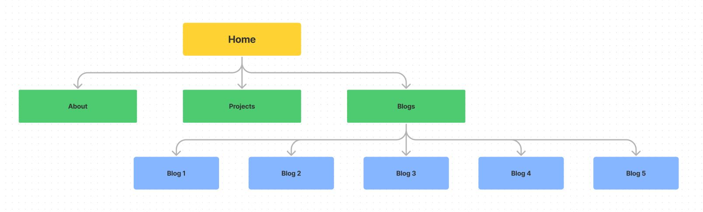

## Screenshots

### Home page

#### Wireframes:
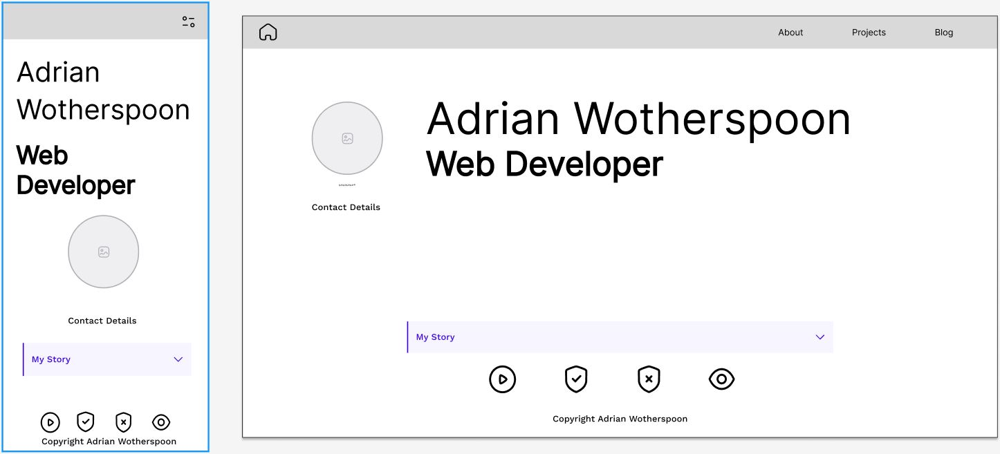

#### Site:
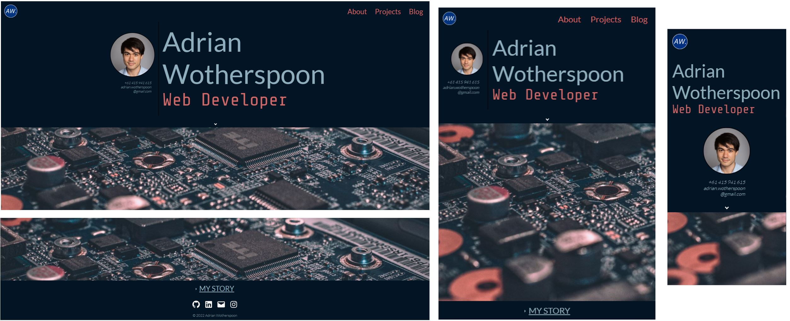

### About page

#### Wireframes:
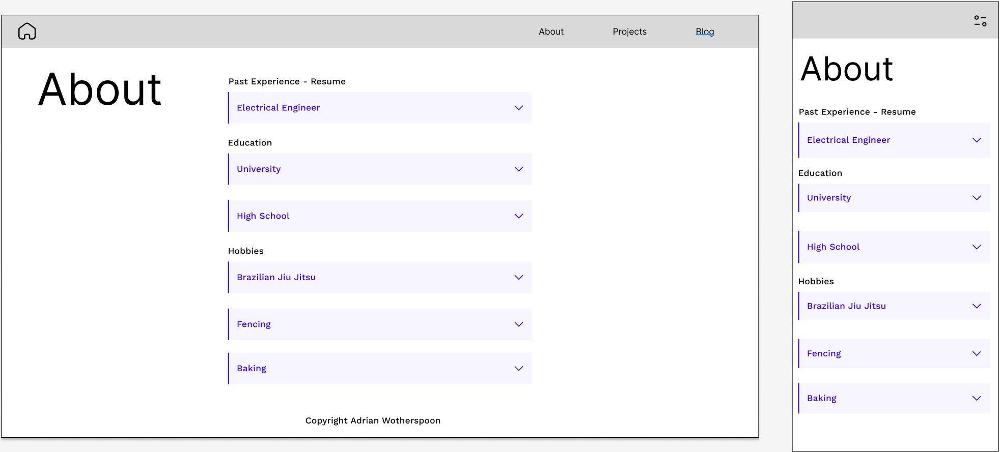

#### Site:
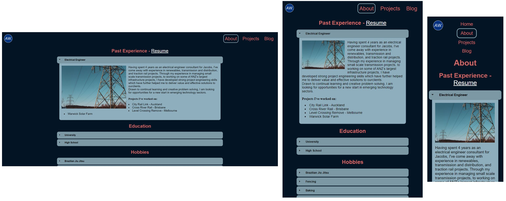

### Projects page

#### Wireframes:
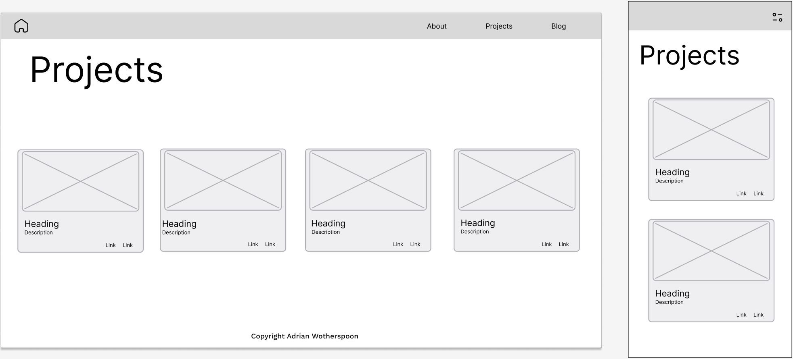

#### Site:
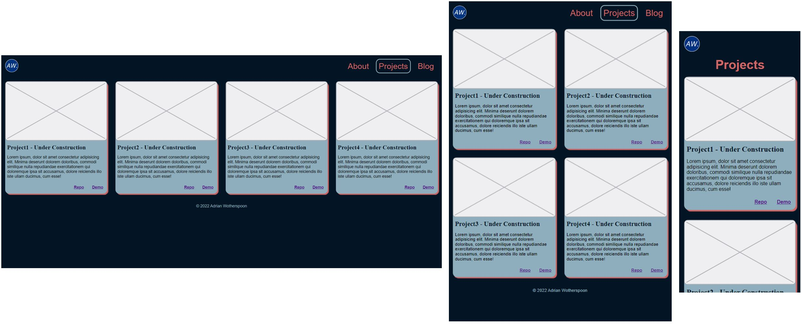

### Blogs page

#### Wireframes:
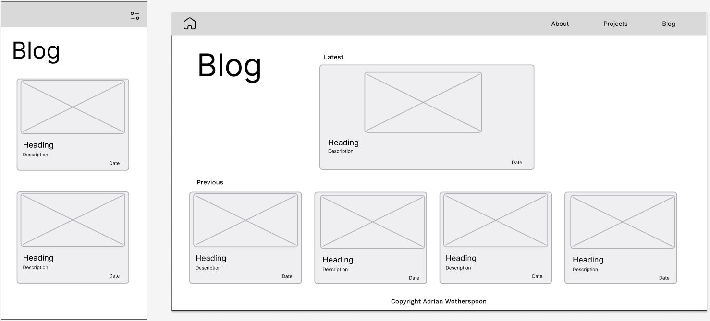

#### Site:
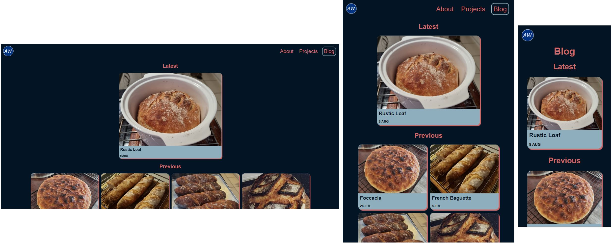

### Example blog post

#### Wireframes:
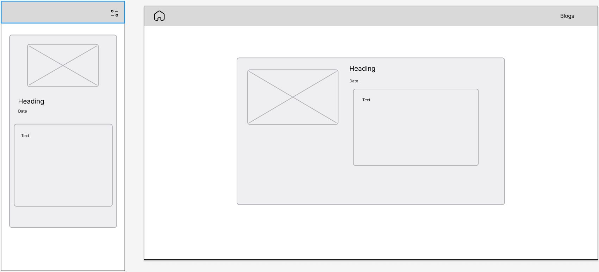

#### Site:
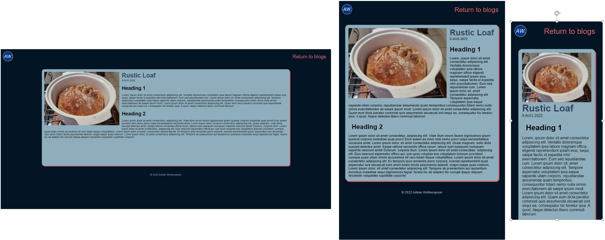

## Technology Stack
This portfolio site has been made with HTML5 and CSS3, and hosted on Netlify. The site will be updated with projects and added JavaScript functionality as developed through the boot camp.