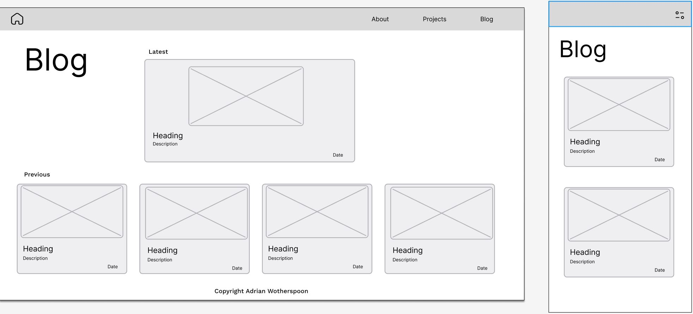
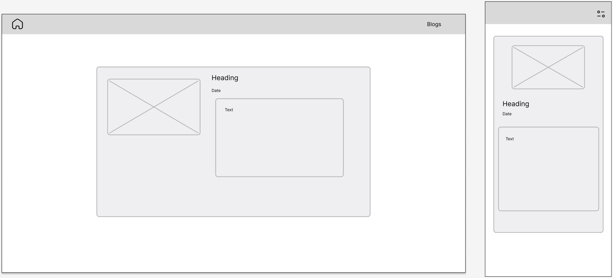

# T1A2 - Portfolio documentation
### [github repo](https://github.com/A-Wotherspoon/CAWDA-2022/tree/main/term1/assignments/T1A2)

### [Netlify Link](https://awotherspoont1a2.netlify.app/index.html)

---
## Purpose
The purpose of this website is to demonstrate my abilities to prospective employers in the tech space as an individual making a transition from electrical engineering to web development. This website aims to achieve this by a combination of showing my technical skills and past experience, while building a personal brand.

## Features
This portfolio website is designed to showcase my capabilities of designing a responsive website with a number of features. The themes of the website was designed around the personal brand I wish to display, 

## Site Map

## Screenshots

### Home page

#### Wireframes:

#### Site:

### About page

#### Wireframes:

#### Site:

### Projects page

#### Wireframes:

#### Site:

### Blogs page

#### Wireframes:

#### Site:

### Example blog post

#### Wireframes:

#### Site:

## Technology Stack
This portfolio site has been made with HTML5 and CSS3, and hosted on Netlify. The site will be updated with projects and added JavaScript functionality as developed through the boot camp.